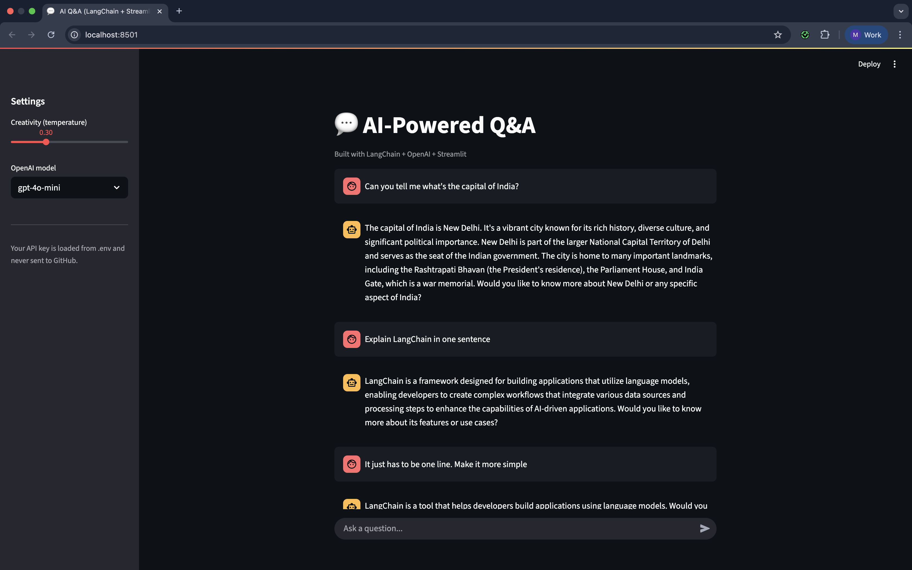
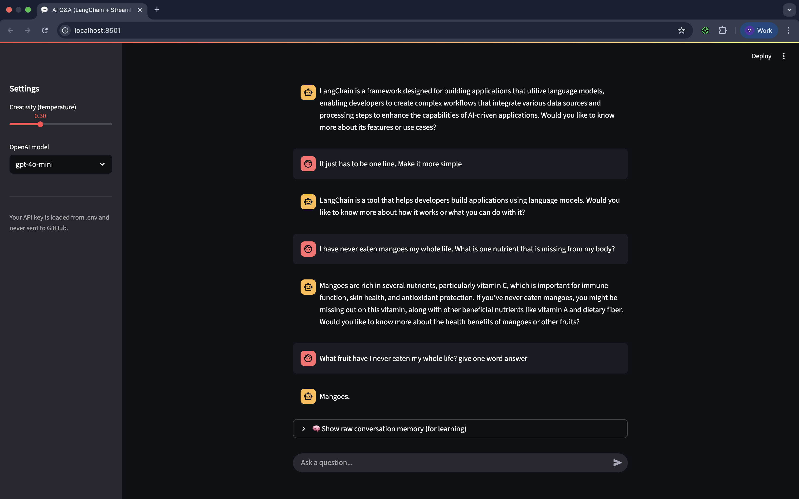

# 🧠 AI Q&A System (LangChain + Streamlit)

## 📌 Description
An interactive chat application that answers user questions using **LangChain**, **OpenAI**, and **Streamlit**.  
The app includes **conversation memory**, so it can remember previous exchanges in the same session.  
Your **OpenAI API key** is stored securely in a `.env` file — just start the app and begin chatting.

---

## 🛠 Tech Stack
- **Python 3.10+**
- **LangChain**
- **OpenAI API**
- **Streamlit**
- **python-dotenv**

---

## 💻 How to Use
1. Place your **OpenAI API key** in a `.env` file (see setup instructions below).
2. Start the Streamlit app.
3. When the browser opens, type your questions directly in the chat box.
4. The AI will reply with contextual answers, remembering previous messages.

---

## 🚀 Setup & Run Instructions

### 1️⃣ Clone the Repository
```bash
git clone https://github.com/mahrooshishaq/AI-Powered-Q-A.git
cd AI-Powered-Q-A
```

### 2️⃣ Create .env File
In the project root, create a file named `.env` and add:

```bash
OPENAI_API_KEY=your_api_key_here
```

### 3️⃣ Create Virtual Environment & Install Dependencies

**MacOS / Linux**
```bash
python3 -m venv venv
source venv/bin/activate
pip install --upgrade pip
pip install -r requirements.txt
```

**Windows**
```bash
python -m venv venv
venv\Scripts\activate
pip install --upgrade pip
pip install -r requirements.txt
```

### 4️⃣ Run the App

**MacOS / Linux**
```bash
streamlit run app.py
```

**Windows**
```bash
streamlit run app.py
```

### 5️⃣ Open in Browser
After running the above command, you'll see something like:

```
Local URL: http://localhost:8501
```

Open it in your browser and start chatting.

---

## 📷 Working Model Screenshots

```markdown


```